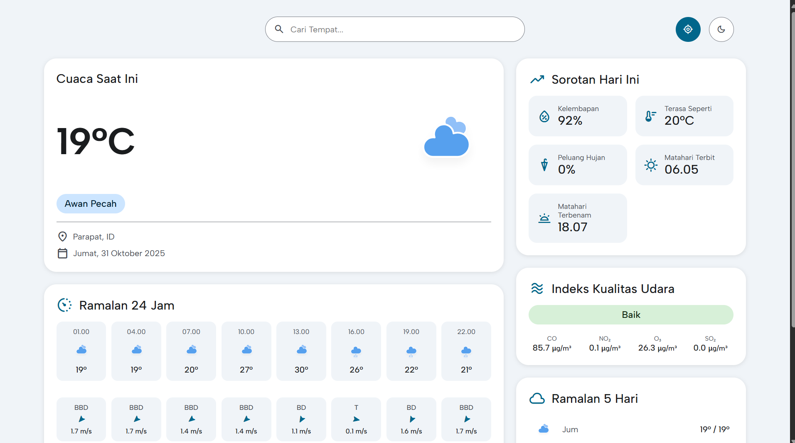
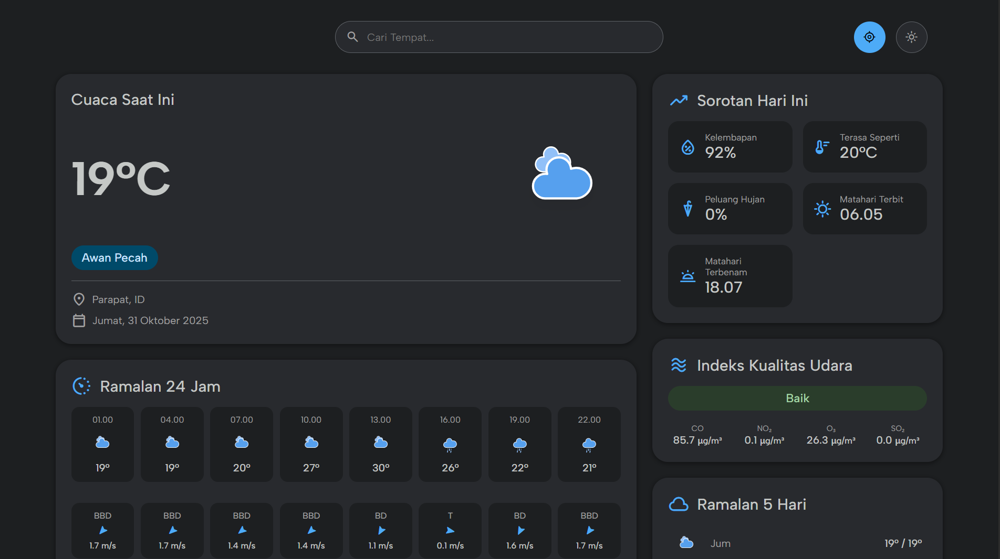

<h1 align="center">Weather Website 🌤️</h1>

<p align="center">
  A modern weather application built with React and Go, providing real-time weather information, forecasts, and air quality data.
</p>

## ✨ Features

- 🌡️ Real-time weather information
- 🌍 Location-based weather data
- 🔍 City search functionality
- 📊 5-day weather forecast
- 💨 Air quality monitoring
- 🌓 Light/Dark theme support
- 📱 Responsive design for all devices

## 🛠️ Tech Stack

### Frontend
- React with TypeScript
- Vite for build tooling
- Material Design Components
- CSS3 with modern features
- Progressive Web App support

### Backend
- Go (Golang)
- Gin web framework
- OpenWeatherMap API integration
- Environment configuration with dotenv

## 🚀 Getting Started

### Prerequisites
- Node.js (v18 or higher)
- Go (v1.24.6 or higher)
- OpenWeatherMap API key

### Installation

1. Clone the repository
```bash
git clone https://github.com/aguspranata005/weather-website.git
cd weather-website
```

2. Set up the backend
```bash
cd backend
cp .env.example .env  # Create and configure your .env file
go mod download
go run main.go
```

3. Set up the frontend
```bash
cd frontend
npm install
npm run dev
```

## 🔧 Environment Configuration

### Backend (.env)
```env
OPENWEATHER_API_KEY=your_api_key_here
```

To obtain an API token from OpenWeather, access the OpenWeather website and register/log in to your account.

### Frontend
The frontend will connect to the backend at `http://localhost:8080` by default.

## 📱 Screenshots




## 📝 License

This project is [MIT](https://opensource.org/licenses/MIT) licensed.

---
<p align="center">Made with ❤️ Agus Pranata</p>